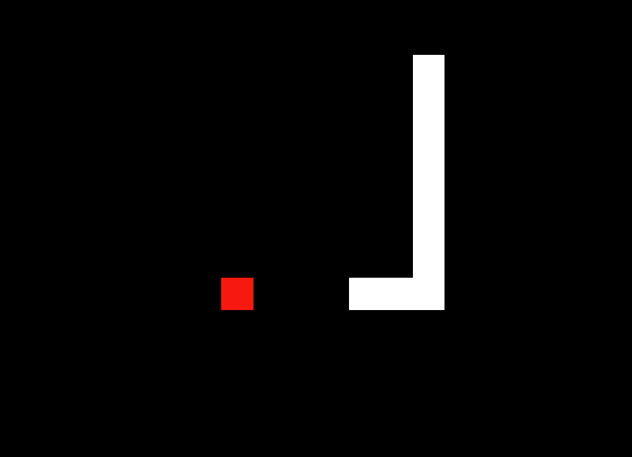
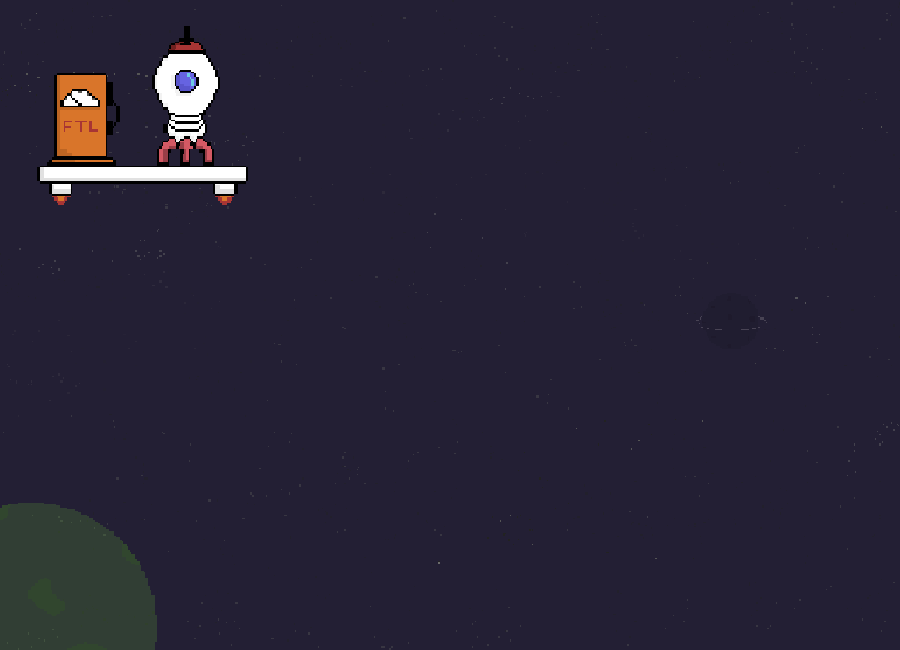
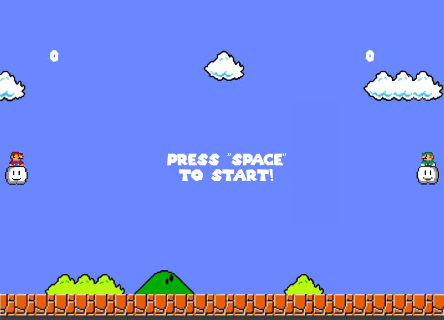

<h1 align="center">Showcase</h1>

A collection of small projects i did :)

<h2 align="center">Snake</h2>

Just a simple snake clone written in P5.js

<h2 align="center">Space Ship</h2>

A physics based rocket landing mini-game made with Godot Engine and drawn with Aseprite

<h2 align="center">Super Pong Bros.</h2>

A pong clone with a few twists. Sprites and music are from Super Mario Bros. but modified. Played around with the physics a bit to try to make it feel like youre flying on a cloud. Didn't really nail it i guess haha

